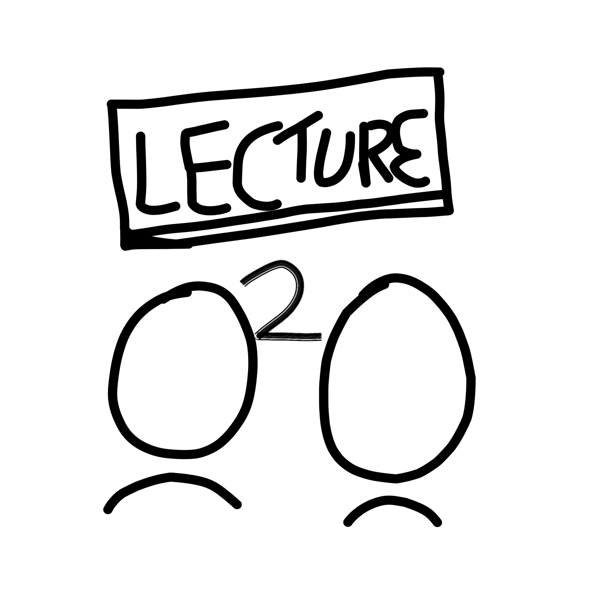

<!-- PROJECT LOGO -->
 

  
  <h3 align="center">Lecture2Gether</h3>
  

    Watch online lectures together!
     
     
    <a href="https://lecture2gether.eu">View Demo (nothing here yet)</a>
    ·
    <a href="https://github.com/TheNerdful8/Lecture2Gether/issues">Report Bug</a>
    ·
    <a href="https://github.com/TheNerdful8/Lecture2Gether/issues">Request Feature</a>
    ·
    <a href="https://github.com/TheNerdful8/Lecture2Gether/pulls">Send a Pull Request</a>
  

## About The Project
<!-- TODO add screenshot -->

Lecture2Gether makes it possible to watch online lectures with friends by pasting a link to a [Lecture2Go](https://github.com/lecture2go/portal-6.2-ce-ga6) Video, a YouTube Video or a simple mp4 link.
The video streams are synchronized to partially restore the social aspect of campus life.

### Built With

* [Vue.js](https://vuejs.org)
* [Vuetify](https://vuetifyjs.com)
* [socket.io](https://socket.io)
* [video.js](https://videojs.com)
* [videojs-youtube](https://github.com/videojs/videojs-youtube)
* [videojs-contrib-hls](https://github.com/videojs/videojs-contrib-hls)
* [Flask](https://flask.palletsprojects.com)
* [Flask-SocketIO](https://flask-socketio.readthedocs.io)
* [Flask-RESTful](https://flask-restful.readthedocs.io)
* [Eventlet](http://eventlet.net)

<!-- TODO: Installation for frontend -->
## Install
### Install Backend
Clone the repository (`git clone https://github.com/TheNerdful8/Lecture2Gether`).

Go to the backend folder `cd Lecture2Gether/lecture2gether_flask/`.

Get [Poetry](https://python-poetry.org/). 

Run `poetry install` to install the dependencys. 

To start the server manually type `poetry run python app.py`.

The installation will also be provided via Docker in the future.

## License

Distributed under the MIT License. See `LICENSE` for more information.
