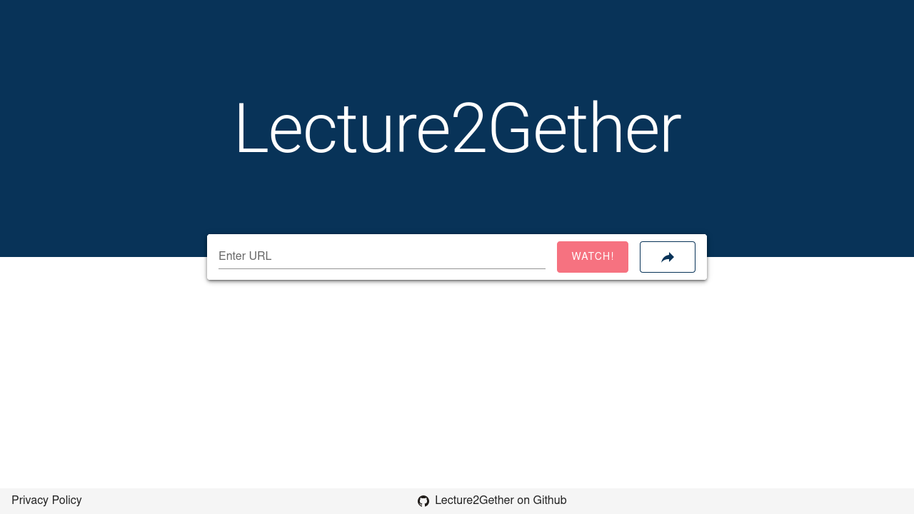
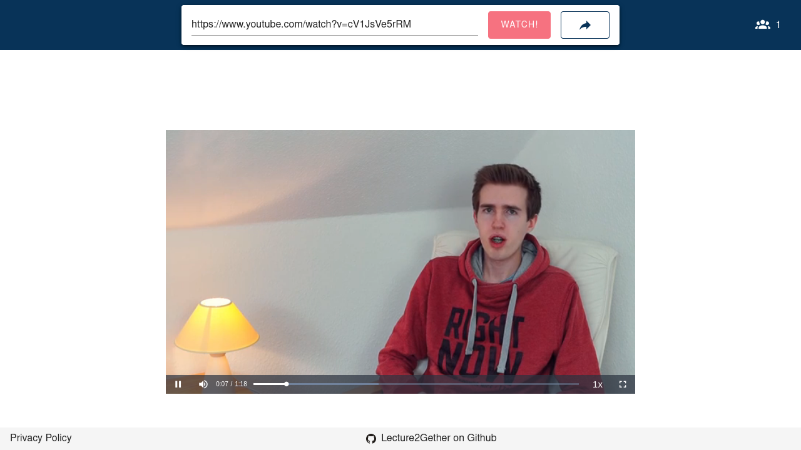

<!-- PROJECT LOGO -->
<br />
<p align="center">
  
  <h3 align="center">Lecture2Gether</h3>
  <p align="center">
    Watch online lectures together!
    <br />
    <br />
    <a href="https://lecture2gether.eu">View Demo</a>
    ·
    <a href="https://github.com/TheNerdful8/Lecture2Gether/issues">Report Bug</a>
    ·
    <a href="https://github.com/TheNerdful8/Lecture2Gether/issues">Request Feature</a>
    ·
    <a href="https://github.com/TheNerdful8/Lecture2Gether/pulls">Send a Pull Request</a>
  </p>
</p>

## About The Project

Lecture2Gether makes it possible to watch online lectures with friends by pasting a link to a [Lecture2Go](https://github.com/lecture2go/portal-6.2-ce-ga6) Video, a YouTube Video, Google Drive Video or a simple .mp4 link.
The video streams are synchronized to partially restore the social aspect of campus life.

[](https://github.com/TheNerdful8/Lecture2Gether/actions?query=workflow%3A%22Flask+CI%22) &nbsp;&nbsp; [](https://github.com/TheNerdful8/Lecture2Gether/actions?query=workflow%3A%22Node.js+CI%22) &nbsp;&nbsp; [](https://github.com/TheNerdful8/Lecture2Gether/actions?query=workflow%3A%22Kubernetes+configuration%22) <!---&nbsp;&nbsp; [](https://ci.mafiasi.de/mafiasi-ag/Lecture2Gether)-->

### Screenshots
<p align="center">
  
  
</table>

## Install
### Using docker (or podman)
You can either build the image from source or use one of the provided versions from our
[Docker Hub Repository](https://hub.docker.com/r/thenerdful8/lecture2gether).

```bash
# for building from source
docker build -t lecture2gether
docker run -p 8000:8000 lecture2gether

# for running from docker hub
docker run -p 8000:8000 thenerdful8/lecture2gether
```

This will start the whole application stack and expose it at
[http://localhost:8000/](http://localhost:8000).


### Full Development Environment
For development we recommend building a dev container (defined in default Dockerfile) and
mounting your local sources into it.

This can be done by simply executing the `dev_up.sh` script.
Any arguments appended to this script are passed to the container runtime so if you want to
define environment variables you should use a `-e NAME=VALUE` flag.
By default the script uses docker as a container runtime but you can choose a different
one (like podman) by exporting the environment variable `CONTAINER_RUNTIME` before executing the script.

### Install single Backend
The backend runs on a redis database.
Run the redis docker `docker run -it -p 6379:6379 redis:buster` or install manually by following [this guide](https://redis.io/topics/quickstart#installing-redis-more-properly).
Set the environment-variables `'REDIS_HOST', 'REDIS_PORT', 'REDIS_DB', 'REDIS_PASSWORD'`
accordingly.
```bash
#Clone the repository
git clone https://github.com/TheNerdful8/Lecture2Gether

#Go to the backend folder
cd Lecture2Gether/lecture2gether_flask/

#Get Poetry
pip3 install poetry --user

#install the dependencies
poetry install --no-root

#start the server manually
poetry run python app.py
```

### Install single Frontend
Install [npm](https://nodejs.org/en/download) on your machine
```bash
#Clone the repository
git clone https://github.com/TheNerdful8/Lecture2Gether

#Go to the frontend folder
cd Lecture2Gether/lecture2gether-vue/

#Install required npm dependencies
npm install

#Run the application with
npm run serve
```

## Configuration
### How to configure
The application is configured at two places:
1) Environment variables for the backend
2) A `settings.json` file for the frontend

Defaults defined in the source code were chosen to work in a development environment. The
Container Image uses different defaults for the frontend which make more sense in a
production environment (defined in `docker/settings.json`).

### Detailed Configuration possibilities
The server can be configured via the following environment variables
Name | Default Value | Description
-----|---------------|------------
SECRET\_KEY | codenames | **Change this in production**
REDIS\_HOST | localhost | Hostname of the redis database which should be used
REDIS\_PORT | 6379 | Port on which redis listens on the redis-host
REDIS\_DB | 0 | Which database on the  redis server should be used
REDIS\_PASSWORD | *empty* | Password to authenticate at the redis server
CLEANUP\_INTERVAL | 900 | Interval (in seconds) of searching for abandoned rooms
CLEANUP\_ROOM\_EXPIRE\_TIME | 3600 | Time (in seconds) until an empty room gets abandoned
CLEANUP\_MAX\_ROOM\_LIFE\_TIME | 86400 | Time (in seconds) until an active room gets abandoned
LOGLEVEL | INFO | Configures the python logging loglevel
GOOGLE\_YOUTUBE\_API\_KEY | *empty* | Google YouTube Data v3 API-key, used to extract meta data from YouTube videos
GOOGLE\_DRIVE\_API\_KEY_BACKEND | *empty* | Google Drive API key, used to access meta data in the backend
GOOGLE\_DRIVE\_API\_KEY_FRONTEND | *empty* | Google Drive API key, used to access Google Drive files in the frontend (see **warning [1]**)
SENTRY\_DSN | *empty* | Sentry connection [DSN](https://docs.sentry.io/error-reporting/configuration/?platform=python#dsn)
SENTRY\_ENV | default | Sentry [environment](https://docs.sentry.io/error-reporting/configuration/?platform=python#environment)

[1] This key is **publicly readable**, restrict its usage to the used website (e.g. https://lecture2gether.eu or equivalent IP address) and Google Drive in the Google API console.

The frontend is configured via a `settings.js` file which should be reachable on a
request to `/settings.js` from the running browser application.
This Javascript file **must** register the variable `window.L2GO_SETTINGS` which **must** be an object defining the
below described properties.
It can be mounted into our provided container under `/app/config/settings.js`.

The frontend settings object is defined as follows:
```
{
    "apiRoot": <string>,        // Under which url the server is reachable for http api calls
    "socketioHost": <string>,   // Under which host the socket.io endpoint is served.
                                // Can be an empty string which results in the same as where the frontend is deployed
    "environment": <string>,    // Determines the sentry environment
    "sentry_dsn": <string>      // Sentry connection DSN
                                // Can be an empty string which disables sentry reporting
}
```

## Statistics
The backend publishes statistical data (No. sessions, No. joined/left rooms, server infos, ...) in the [Prometheus](https://prometheus.io/) format to `/metrics`. This can be scraped by a [Prometheus](https://prometheus.io/) server and displayed in e.g. [Grafana](https://grafana.com/).

## Built With
* [Vue.js](https://vuejs.org)
* [Vuetify](https://vuetifyjs.com)
* [socket.io](https://socket.io)
* [video.js](https://videojs.com)
* [videojs-youtube](https://github.com/videojs/videojs-youtube)
* [videojs-contrib-hls](https://github.com/videojs/videojs-contrib-hls)
* [Flask](https://flask.palletsprojects.com)
* [Flask-SocketIO](https://flask-socketio.readthedocs.io)
* [Prometheus Flask exporter](https://github.com/rycus86/prometheus_flask_exporter)
* [Prometheus Python Client](https://github.com/prometheus/client_python)
* [gevent](http://gevent.org)
* [BeautifulSoup](https://www.crummy.com/software/BeautifulSoup/)
* [Google API Python Client](https://github.com/googleapis/google-api-python-client/)
* [Nose](https://nose.readthedocs.io/en/latest/)
* [Redis](https://redis.io/)
* [coolname](https://github.com/alexanderlukanin13/coolname)

## License

Distributed under the MIT License. See `LICENSE` for more information.
